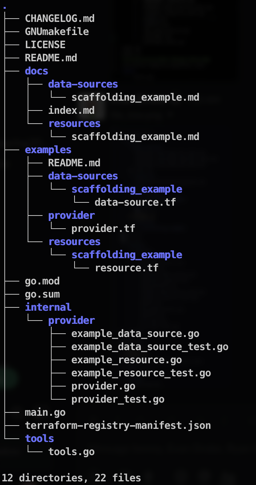

### Create.Read.Update.Delete (CRUD)
Terraform providers work closely with the idea of CRUD operations. Meaning that the providers
try to classify API functionality into 4 groups, here are examples related to our API:
- C[reate]
- - Creates new resource: dev, ops, devops, engineers
- R[ead]
- - Read in an existing resource
- U[pdate]
- - Update an existing resource, however we can not affect the sub-resources (engineers) inside it
- D[elete]
- - Deletes an existing resource, however we can not affect those resource's children

### Schema
The terraform provider framework manages data through its schema. The schema is the structure of data
internal to the provider. This schema should loosely mirror the API data structure.[schema docs](https://developer.hashicorp.com/terraform/plugin/sdkv2/schemas)

### File Hierarchy

